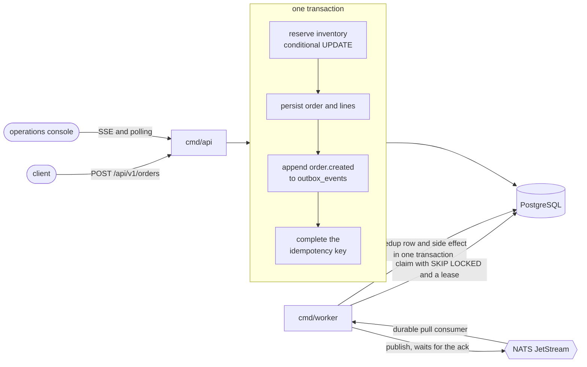

# Architecture

## Shape

A modular monolith with explicit bounded contexts, compiled into two binaries
that share one codebase and one database.

The console is a static bundle served by nginx, which proxies `/api` to the API
so the browser talks to one origin.

## Contexts

| Context | Owns |
|---|---|
| `internal/order` | The order aggregate, its state machine, creation and confirmation |
| `internal/inventory` | Stock positions and the reservation rule |
| `internal/outbox` | The event envelope, the claim protocol and the publisher |
| `internal/consumer` | Delivery, deduplication, retry classification, dead letters |
| `internal/idempotency` | Request fingerprints and the claim protocol |
| `internal/ops` | The operational read model the console shows |
| `internal/platform` | Configuration, logging, errors, transport, database, broker, telemetry |

Each context has `domain`, `app` and `infra` where it needs them. The dependency
arrow points inwards: infrastructure depends on application, application depends
on domain, and the domain depends on the standard library and nothing else.

## Boundaries that are enforced, not described

`test/architecture_test.go` walks the import graph and fails when:

1. A package under `internal/*/domain` imports anything outside the standard
   library and other domain packages.
2. A package under `internal/*/app` imports an `infra` package.
3. A package outside `infra` and `platform` imports a database or broker client.

The first rule was verified by temporarily importing pgx into the order domain
and watching the test fail, which is the only way to know a test of this kind
works.

## Why two binaries

The API is request-scoped and scales with traffic. The worker is a long-running
loop that scales with event volume and has strict shutdown semantics: stop
claiming, drain in flight publishes within a bounded budget, leave anything
unfinished claimable. Sharing a process would give two very different drain
behaviours one budget, and would make a publisher saturating the connection pool
an API latency problem.

They share configuration, logging, the error taxonomy, the transaction manager
and the broker client, because those are decisions the system makes once.

## Where the important code is

Three files carry the correctness claim:

- `internal/inventory/infra/reserver.go` is the conditional UPDATE and the sort
  that prevents deadlocks.
- `internal/order/app/create_order.go` is the two transaction idempotency
  protocol and the single business transaction.
- `internal/outbox/app/publisher.go` is the bounded pool, the backpressure and
  the drain.

## What this shape makes easy, and what it does not

Easy: reasoning about atomicity, because the write path is one transaction in one
process. Adding a second consumer. Extracting a context later, because the domain
has no infrastructure imports and the application layer already talks to ports.

Not easy: scaling the write path beyond what one PostgreSQL primary can do, and
deploying one context independently of another. Both are stated in the README
under production evolution, with what would change first.
